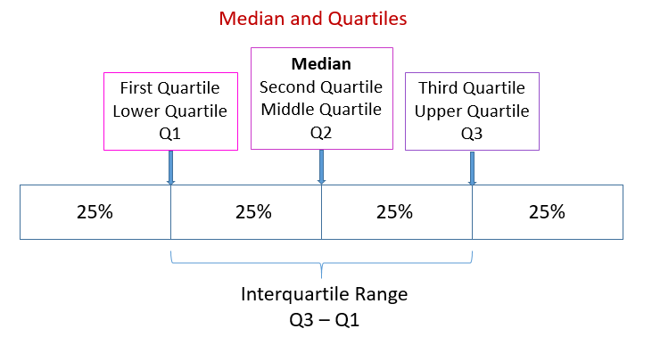

# 描述統計學

## 數據測量 Numerical Measures
### 樣本 Sample

樣本$$n$$是母體(Population)$$N$$的子集，而且抽樣時應該要平均，需與母體有同樣性質。當測量是從樣本所產生即稱為樣本統計量(Sample Statistic)。而從母體所測量則稱為母體參數(Population Parameters)。統計學中從樣本統計量為母體參數的點估計(Point Estimate)，用以推論母體。

## 單變量分析 Univariate Analysis

### 平均值 Mean

樣本平均值是一個統計量(Statistic)且是一個點估計。

$$
\bar{x} = \frac{\sum x_i}{n}
$$

母體平均值是一個參數(Parameter)。

$$
\mu = \frac{\sum x_i}{N}
$$

### 中位數 Median

數列經過排列後其中間的數值即中位數。

當數列為奇數時為中間的數值，當列為偶數時取中間兩數之平均。

### 眾數 Mode

為數列中出現最多次的數字。眾數不一定只有一個

### 變異數 Variance

變異數為變數與平均值之差平方後相加。

不偏樣本變異數(Unbiased Sample Variance)

$$
S^2 = \frac{\sum(x_i - \bar{x})^2}{n-1}
$$

母體變異數(Population Variance)

$$
\sigma^2 = \frac{\sum(x_i - \bar{x})^2}{n}
$$

### 標準差 Standard Deviation
為變異數開主平方根，反映組內個體間的離散程度。例如數組```X = 4,4,-4,-4```與```Y = 7,1,-6,-2```看似相同但是實際上Y離散程度較大。

樣本標準差(Sample Standard Deviation)

$$
\sigma = \sqrt{\sigma^2}
$$

母體標準差(Population Standard Deviation)

$$
S = \sqrt{S^2}
$$

##### Example

Dataset 600, 470, 170, 430, 300

$$mean = \frac{600 + 470 + 170 + 430 + 300}{5} = 394$$

$$\sigma^2 = \frac{ (600-394)^2 + (470-394)^2 + (170-394)^2 + (430-394)^2 + (300-394)^2}{5} = 21704$$

$$\sigma = \sqrt{21704} = 147$$

### 離散程度 Dispersion


#### 四分位數 Quartile
第一四分位數(Q1)為數組25%位置的數值。

第二四分位數(Q2)為數組50%位置的數值，或稱中位數。

第一四分位數(Q3)為數組75%位置的數值。

#### 四分位距 Interquartile Range
為Q1及Q3的距離，一般用於箱型圖。


## 雙變量分析 Bivariate Analysis

### 協變 Covariance

協變描述一個向量的坐標，在向量空間的基底或坐標系轉換之下，會如何改變。只要X與Y的值越大，協變係數(Covariance Coefficient)也會越大。大的協變係數無法明確表示兩個變數是否有關聯，大的協變係數可能為強烈關聯性與微弱關聯性。

不偏樣本協變(Unbiased Sample Covariance)

$$
S_{xy} = \frac{\sum{(x_i-\bar{x})(y_i-\bar{y})}}{n-1}
$$

母體協變(Population Covariance)

$$
\sigma_{xy} = \frac{\sum(x_i-\mu_x)(y_i-\mu_y)}{N}
$$

### 相關 Correlation

相關係數(Correlation Coefficient)顯示兩個隨機變量之間線性關係的強度和方向。相關係數介於 [-1, 1]之間，越接近-1或1表示相關性越強烈。當相關係數為正時，兩個變量為正關係，為負時，兩個變量為負關係。


不偏樣本相關係數(Unbiased Sample Correlation)

$$
r_{xy} = \frac{S_{xy}}{S_x S_y}
$$

不偏母體相關係數(Unbiased Population Correlation)

$$
p_{xy} = \frac{\sigma_{xy}}{\sigma_x \sigma_y}
$$